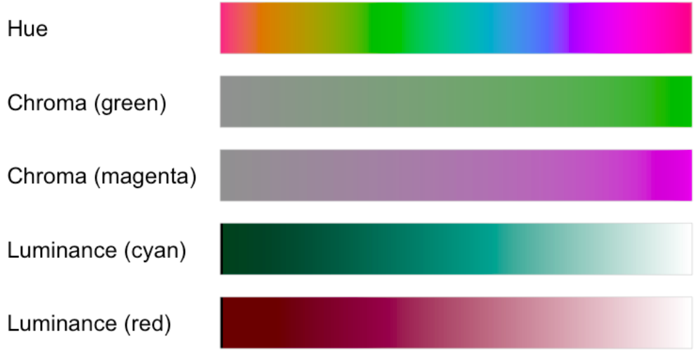
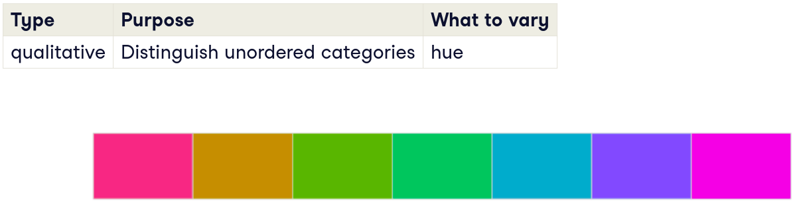
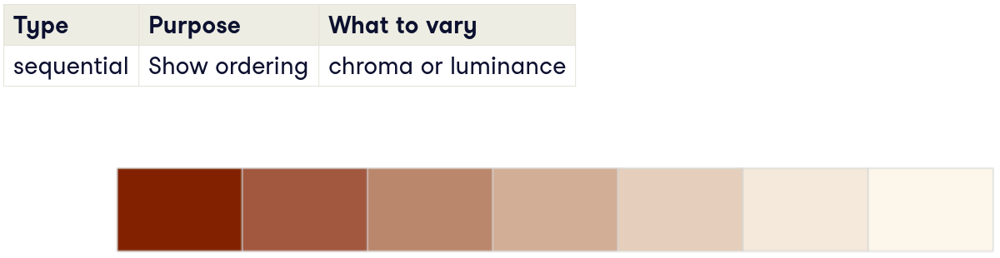
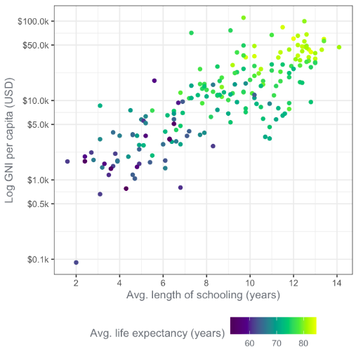
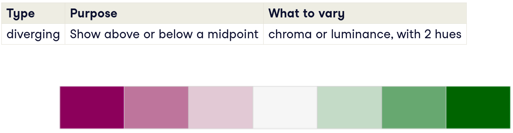
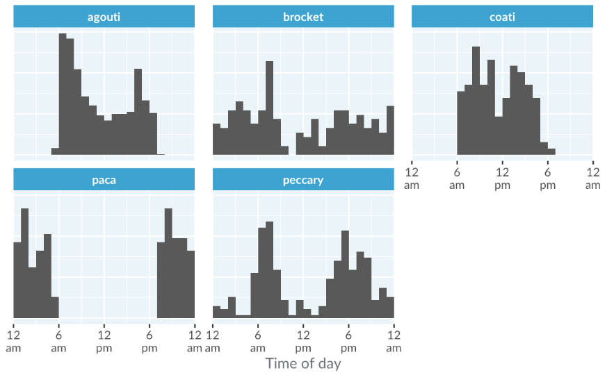
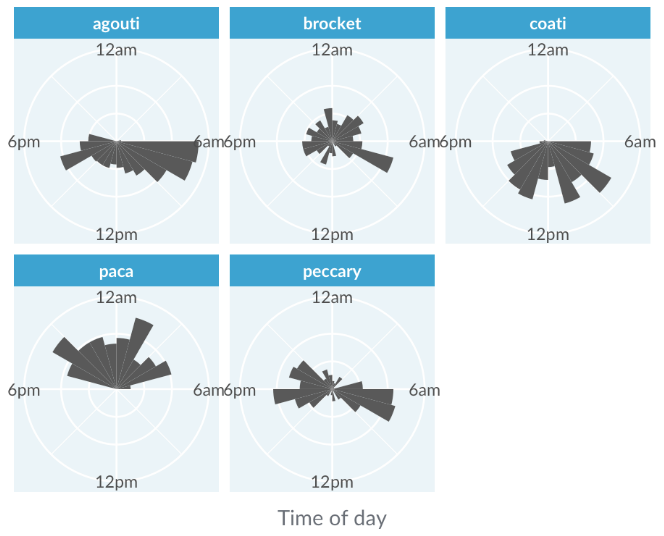
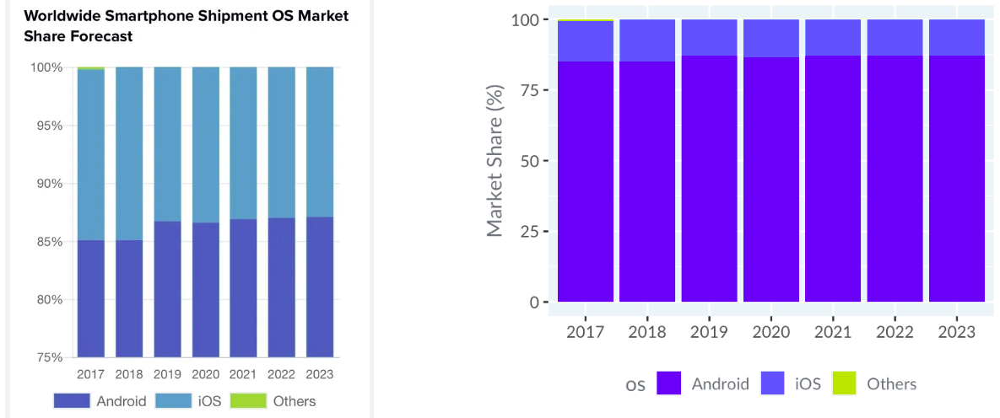
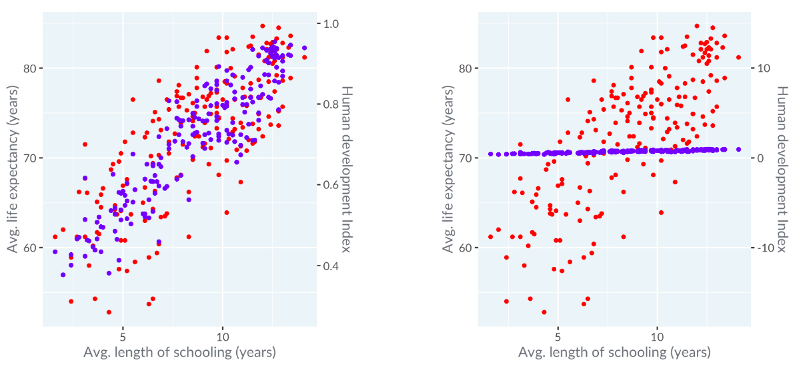

# Data visualization

## Colorspaces 

*Hue Chroma Luminance* and is designed to do deal with colour perception.

**Hue** - is pallet of rainbow colours.

**Chroma** - is intensity of the color - from grey to a intense colour.

**Luminance** - is a brightness of a color - from dark to bright.

## Color scale

### Qualitative

For describing unordered data - vary *Hue* parameter.

### Sequential

For describing ordered data - vary *Chroma* or *Luminance* parameters.

For continuous data you can use hue pallet

 

### Diverging

To show data that have to diverging options - vary *Chroma* or *Luminance* parameters with 2 hues.

## Pie plots

*Pie plots* (sometimes called pie charts) are extremely popular, but often difficult to interpret. They are just bar plots converted into polar coordinates, and humans are generally worse at perceiving angles accurately compared to lengths.

x-y plots almost always better than pie plots. Pie plots is a good choice to use only when data has same natural circularity.

For instance, here is a plot that describes animal activities per time of day. Paca is a nocturnal animal and the histogram looks split.

Rose-plot looks better

## Bar plots

You should always start bar plot at zero! Otherwise, you distort the relative hight of the bars. If you cannot include 0, use dot plot instead.

Also, avoid unnecessary use of 3d perspective.

## Dual axes

One popular but terrible idea is to draw a scatter plot or line plot with two different y-axes. This typically happens when you have two metrics with different units, and different scales that you want to plot against a common x-axis. The problem is that by changing the relationship between the two axes, you can tell almost any story that you want with the data.

**You should make correlation assumptions from dual axes plot**! If you change scale, perception changes as well. It's better to plot them on different panels

