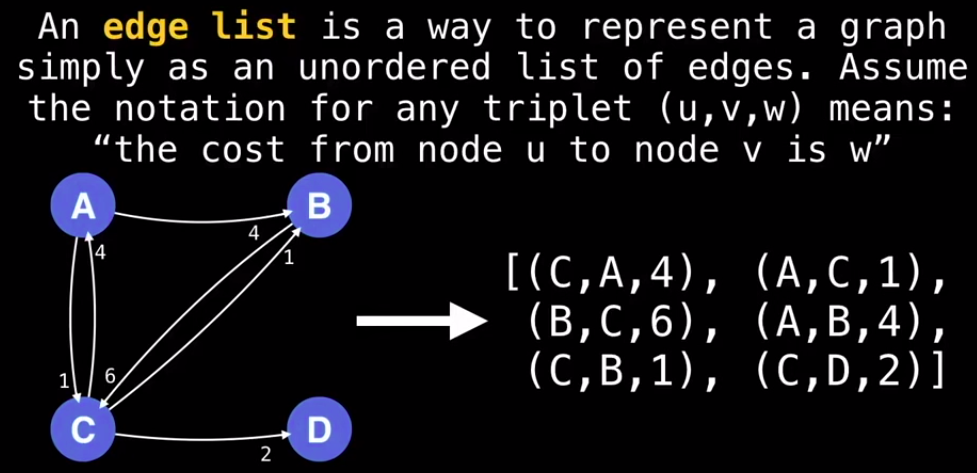
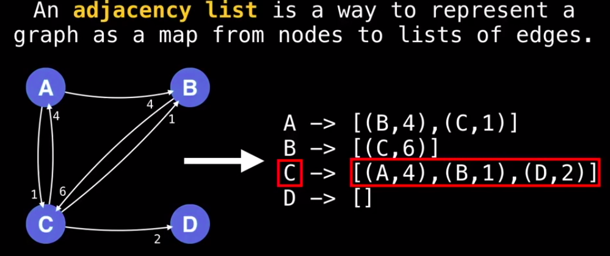
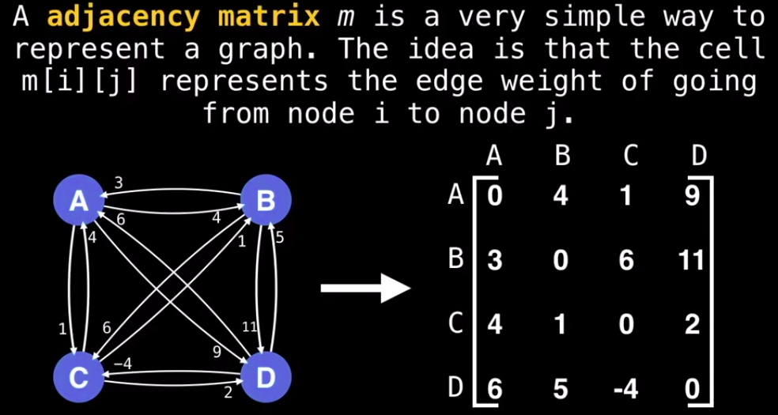
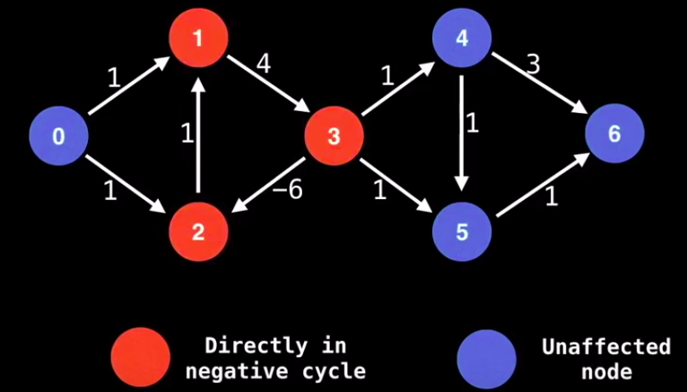
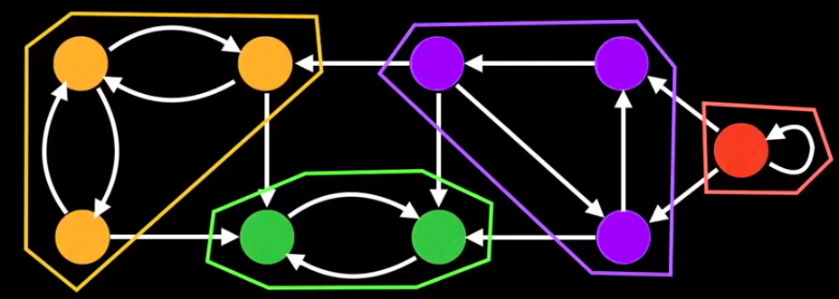
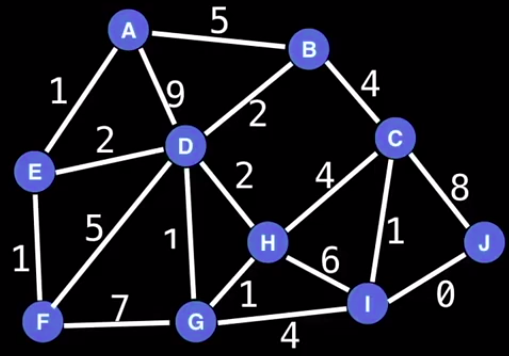
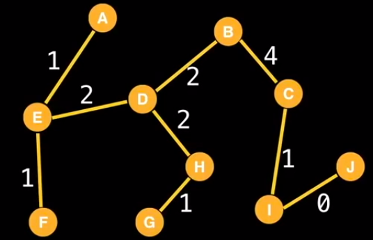

# 101 Graph Theory

## Representation

### Edge list



### Adjacency list



### Adjacency matrix



## Common problems

1. Shortest path

2. Topological search

3. Is there a path between nodes?

4. Detecting negative cycles

   

5. Finding strongly connected components

   

5. Traveling Salesman problem
6. Finding Minimum Spanning tree

|  |  |
| ------------------------------------------------------------ | ------------------------------------------------------------ |
|                                                              |                                                              |

## Depth first search

```go
type Graph struct {
	adjList [][]int
}

func DepthFirstSearchRec(graph Graph, startVertex int) []int {
	var visits = make([]bool, len(graph.adjList))
	var visitedVertices = make([]int, 0, len(graph.adjList))
	var dfs func(vertex int)
	dfs = func(vertex int) {
		if visits[vertex] {
			return
		}
		visits[vertex] = true
		visitedVertices = append(visitedVertices, vertex)
		for _, v := range graph.adjList[vertex] {
			dfs(v)
		}
	}
	dfs(startVertex)
	return visitedVertices
}
```

### Connected Components

```go
type Graph struct {
	adjList [][]int
}

// graph - adjacency list representation
// map - where the keys are the number of component
// and values are vertices belonging to the component
func ConnectedComponents(graph Graph) map[int][]int {
	var visits = make([]bool, len(graph.adjList))
	var components = make([]int, len(graph.adjList))
	var count = 0
	var dfs func(vertex int)
	dfs = func(vertex int) {
		if visits[vertex] {
			return
		}
		visits[vertex] = true
		components[vertex] = count
		for _, v := range graph.adjList[vertex] {
			dfs(v)
		}
	}
	for vertex, _ := range graph.adjList {
		if !visits[vertex] {
			dfs(vertex)
			count++
		}
	}
	var res = map[int][]int{}
	for vertex, component := range components {
		res[component] = append(res[component], vertex)
	}
	return res
}
```

